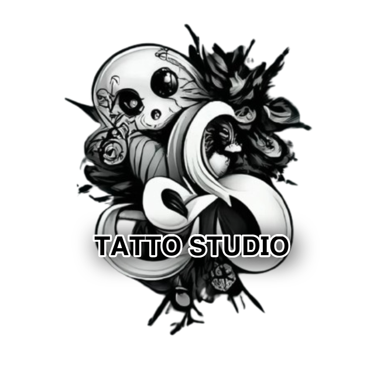
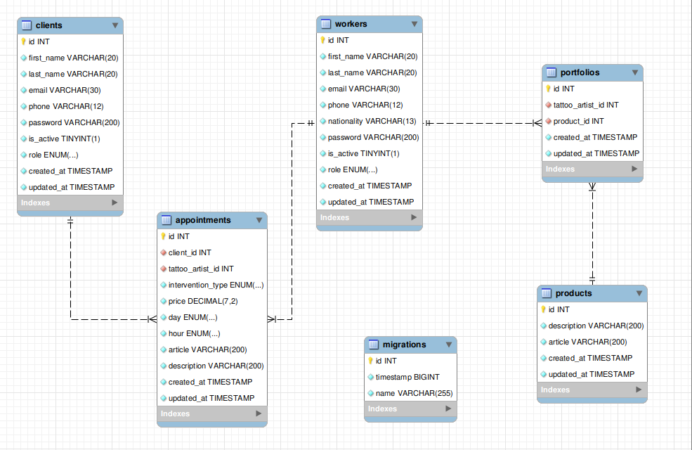

# Welcome to my backend app
<div align="center">
  
</div>
<br></br>
<div>
<a href = "antonioinsa@tutanota.com"></a>
<a href="https://www.linkedin.com/in/antonioinsa/" target="_blank"></a> 
</p>
</div>
<br></br>
<details>
  <summary>Contenido 📝</summary>
  <ol>
    <li><a href="#objetivo">Objetivo</a></li>
    <li><a href="#sobre-el-proyecto">Sobre el proyecto</a></li>
    <li><a href="#deploy-🚀">Deploy</a></li>
    <li><a href="#stack">Stack</a></li>
    <li><a href="#diagrama-bd">Diagrama</a></li>
    <li><a href="#instalación-en-local">Instalación</a></li>
    <li><a href="#endpoints">Endpoints</a></li>
    <li><a href="#database">DataBase (accesos y registros)</a></li>
    <a></li>
    <li><a href="#licencia">Licencia</a></li>
    <li><a href="#agradecimientos">Agradecimientos</a></li>
    
  </ol>
</details>

## Objetivo
Este proyecto requería una API funcional conectada a una base de datos con al menos una relación de uno a muchos y una relación de muchos a muchos.

## Sobre el proyecto
Se ha creado una aplicación web para una empresa de tatuajes, en la que los clientes puedan registrarse, logearse, modificar su perfil y acceder a este.
Por otra parte, a traves de su login; crear, editar o eliminar la cita o citas solicitadas con uno o varios tatuadores, ademas de poder consultar todas sus citas.

Como toda empresa, ademas de clientes, son indispensables sus trabajadores. Los cuales podran logearse para acceder a la visualizacion de sus citas con los clientes y despues de una valoracion de los requisitos para el boceto requerido por el cliente, realizar en dicha cita una actualizacion para fijar el precio del trabajo ha realizar.

En esta API, cualquier persona registrada o no, podra ver los tatuadores en plantilla, mostrando unicamente su primer nombre, ultimo nombre y nacionalidad, ya que son tatuaderes de alto prestigio los cuales a lo largo de su trayectoria han ido ganando seguidores a traves de sus trabajos.
Por ello se permite el acceso a estos trabajadores, pero unicamente se podran ver sus trabajos si eres un usuario registrado.

La supervision de la API la realizara el superAdmin, el cual podra ver todos los clientes y trabajadores de su estudio de tatuajes, al igual que dar de alta o baja sus trabajadores y cambiar de "role" a los usuarios.

## Deploy 🚀
<div align="center">
    <a href="https://antonioinsa.github.io/Tattoo_studio/"><strong> Tattoo_studio </strong></a>🚀🚀🚀
</div>

## Stack
Tecnologías utilizadas:
<div align="center">

<a href="https://www.expressjs.com/">
    
</a>
<a href="https://nodejs.org/es/">
    
</a>
<a href="https://www.typescriptlang.org/">
    
</a>
<a href="https://www.postman.com/">
    
</a>
<a href="https://www.mysql.com/">
    
</a>
<a href="https://git-scm.com/">
    
</a>
<a href="https://www.github.com/">
    
</a>
<a href="https://jwt.io/">
    
</a>
 </div>


## Diagrama BD


## Instalación en local
1. Clonar el repositorio
2. ` $ npm install `
3. Conectamos nuestro repositorio con la base de datos 
4. ```$ npx typeorm-ts-node-commonjs migration:run -d ./src/db.ts ```
5. ``` $ Ejecutamos los seeders ``` 
6. ``` $ npm run dev ``` 

## Endpoints
<a href="./src/http/thunder-collection_Tattoo_studio.json">Click aqui para acceder al JSON</a>

## DataBase
En este apartado se adjuntan las tablas en formato SQL para  insertar los registros en la base de datos.

Tanto clients como workers estan creados con una password generica "123456789", para una mayor sencillez a la hora de probar la APP.

<u>Accesos =></u>

**user (login clients)**

{
  "email": "bradki9@shareasale.com",
  "password": "123456789"
}

**admin (login workers)**

{
  "email": "pgirvan0@delicious.com",
  "password": "123456789"
}

**superAdmin (login workers)**

{
  "email": "akingaby4@dailymotion.com",
  "password": "123456789"
}

<u>Registros =></u>
<div>
<p><a href="./src/DataBase/clients.sql">Click aqui para acceder clients.sql</a></p>
<p><a href="./src/DataBase/workers.sql">Click aqui para acceder workers.sql</a></p>
<p><a href="./src/DataBase/products.sql">Click aqui para acceder products.sql</a></p>
<p><a href="./src/DataBase/portfolio.sql">Click aqui para acceder portfolio.sql</a></p>
</div>

## Licencia
Proyecto desarrollado por Antonio Insa Benavent, bajo licencia MIT.

Consulta el archivo <a href="./LICENSE">`LICENSE`</a> para más información.

## Agradecimientos:

Agradezco a mis compañeros el tiempo dedicado a resolver mis dudas y bloqueos.

